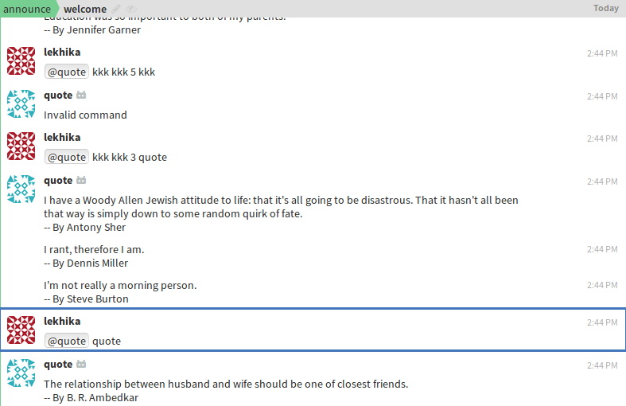

# Quote_generator

A very own quote generator zulip Bot.

## Requirements

1. zulip
2. pprint

## Steps to Run

1. Install requirements using `pip3 install -r requirements.txt`
2. Create a zulip realm on [https://zulipchat.com](https://zulipchat.com)
    - Create a Bot on zulip.
    - Go to settings from the gear menu in the top right corner.
    - Create a new generic bot from `Your bots`.
    - Download the bot's zuliprc and save it in your home directory as `.zuliprc`.
3. Run the Bot using `python3 bot.py`.

## Usage

1. Mention the bot-name in your zulip realm with a word quote mentioned in it.
2. 4th word of the message should be the number which states the number of quotes to receive.
3. It must to have word `quote` in your message to receive atleast one quote.

